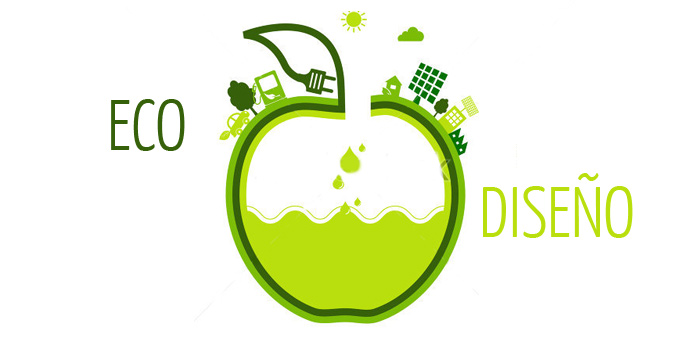

# 1.6 Ecodiseño

El ecodiseño es una filosofía que busca crear productos y servicios sostenibles, minimizando su impacto ambiental en todas las etapas de su ciclo de vida: diseño, producción, uso y disposición final. Esto implica añadir criterios ambientales a los tradicionales de diseño, como coste, utilidad y seguridad.

Al aplicar el ecodiseño, se identifican y mejoran los aspectos ambientales del producto mediante un proceso de mejora continua. Estas mejoras pueden incluir cambios simples que, implementados a tiempo, resultan en avances significativos en sostenibilidad y, a menudo, en reducciones de costes.

Las ventajas del ecodiseño para las empresas incluyen:

  Reducción de costes: Disminución del consumo energético y de materias primas, optimización de técnicas de producción y reducción de gastos en transporte y embalaje.

  Cumplimiento normativo: Alineación con la legislación ambiental vigente.

  Innovación y diferenciación: Incorporación de elementos innovadores que enriquecen el proceso creativo y diferencian el producto en el mercado.

Para implementar el ecodiseño, existen diversas herramientas cualitativas y cuantitativas que analizan el perfil ambiental del producto, como el Análisis de Ciclo de Vida (ACV), la Huella Ecológica y la Huella de Carbono. La elección de la herramienta adecuada depende de las características específicas del producto y de la empresa.

Integrar el ecodiseño en el desarrollo de productos no solo contribuye a la sostenibilidad ambiental, sino que también mejora la competitividad y la imagen de la empresa en el mercado actual.
